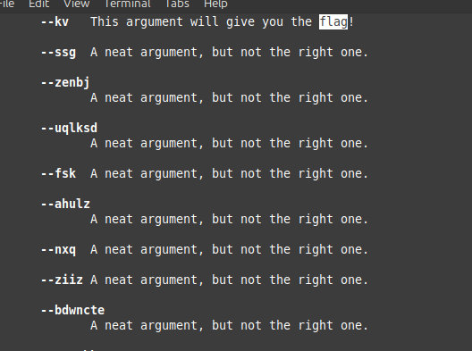
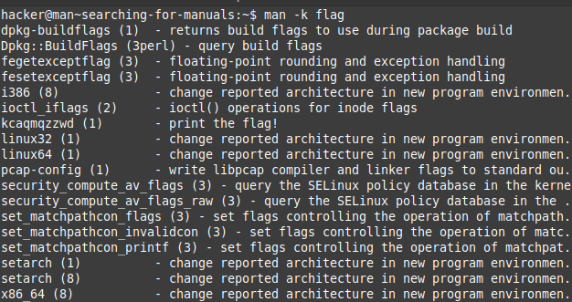

# Digesting Documentation
## flags and notes, 

1) pwn.college{I7jCsDR65Chwue2U-Mt0W8SmU95.dRjM5QDL2gTN0czW}
	>/challenge/challenge --giveflag
	- The challenege is on reading documentation on linux command and understand how to properly use them, 

2) pwn.college{IdY_gbLELzdZYHHBpFXzjmUbPUH.dVjM5QDL2gTN0czW}
	>/challenge/challenge --printfile /flag
	- As per the given description of the command /challenge/challenge binary reads any file given as an crgument to --printfile.
	- / flag was passed as argument to the file, to print the flag to the challenge solving the challenge. 

3) pwn.college{k4IkuHOsTl1kYVuqWUXChTRFVcP.dRTM4QDL2gTN0czW}
	>man challenge
	>/challenge/challenge --kkuslk 414
	- the man page of challenge gave us info on how to "use" the command, 
	- Followed instructions to read the command. 
4) pwn.college{EU-o3a_-O5D578zC4IcoBwV6Zvh.dVTM4QDL2gTN0czW}
	- searched the documentation using " / "
	

5) pwn.college{UkcDaJHq68Smqz6_zwQdA4BNJKm.dZTM4QDL2gTN0czW}

	- This was a tricky one couldn't figure out at start how to proceed with the challenge
	- rereading the challenge description, proceeded to read the `man man` page
	- found the command man -k <term to search>
	- That's it !! there it was, 

	- Read the man page and solved the challenge. 

